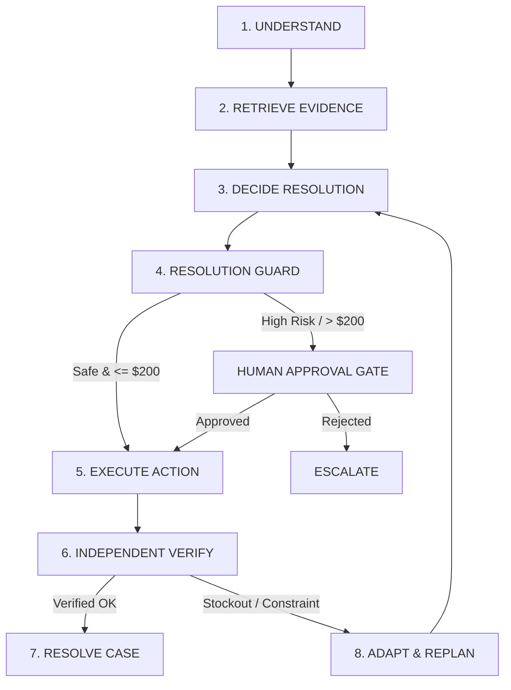

# ResolveOS 🛡️
### Autonomous Customer Resolution Platform

[](https://fastapi.tiangolo.com/)
[](https://nextjs.org/)
[](https://langchain-ai.github.io/langgraph/)
[](https://www.sqlalchemy.org/)
[](LICENSE)

**ResolveOS** is an autonomous, safe, and verifiable customer-resolution engine built to resolve enterprise customer issues (returns, physical replacements, cancellations, damaged goods) across simulated enterprise inventory, payment, and order management systems.

Unlike standard conversational chatbots that only emit text responses, ResolveOS retrieves real structured data, reasons over versioned policy constraints, executes transactional business actions with idempotency keys, independently verifies database state post-execution, and dynamically adapts when original plans fail.

---

## 🔄 Agentic Architecture

The core decision engine is powered by an explicit 7-Node State Machine Loop:

```
UNDERSTAND ──► EVIDENCE ──► DECIDE ──► GUARD / APPROVAL ──► ACT ──► VERIFY ──► ADAPT / RESOLVE
```



---

## ✨ Key Features

- 🎯 **Autonomous Stockout Adaptation**: Automatically adapts physical replacement plans to Full Refunds when stock levels across all distribution centers show `0 available`.
- 🛡️ **Deterministic Business Rule Guard**: Enforces policy return windows (15 days for electronics) and financial thresholds ($200.00 auto-approval limit).
- ⚖️ **Operations & Judge Approval Console**: Human-in-the-loop governance interface allowing operations leads to review and authorize high-risk transactions.
- 🔍 **Independent Post-Action DB Verification**: Verifies database state post-execution directly against relational database records (`refunds`, `payments`, `inventory`) before closing cases.
- 📊 **Agent Trace Inspector**: Interactive, step-by-step visual graph inspector displaying raw JSON payloads, policy chunk evidence, and state transitions.
- 🔐 **Role-Based Access Control (RBAC)**: Role-filtered navigation for Customers (`Help Center`, `My Orders`), Operations Leads (`Judge Console`), and Support Agents (`Escalations`).

---

## 🚀 Pre-Configured Test Scenarios

You can test 4 interactive scenarios with 1 click on the **Help Center** hero banner:

| Scenario | Demo Order # | Issue & Amount | Expected Agent Outcome |
| :--- | :--- | :--- | :--- |
| **1. Stockout Adaptation** | `ORD-2026-8801` | Damaged Headphones ($199.99) | Stock is **0** $\rightarrow$ Agent adapts replacement plan to **Full Refund ($199.99)** $\rightarrow$ Auto-verified. |
| **2. High-Value $200+ Approval** | `ORD-2026-8802` | Defective Smartwatch Bundle ($499.98) | $499.98 exceeds $200 limit $\rightarrow$ Routes to **Human Approval Queue** $\rightarrow$ Auto-executes upon approval. |
| **3. Expired Return Window** | `ORD-2026-8803` | Wireless Earbuds ($89.99) delivered 40 days ago | Exceeds 15-day policy return window ($40 > 15$) $\rightarrow$ Safely **escalates case** to support team. |
| **4. Order Cancellation** | `ORD-2026-8804` | Unfulfilled Mechanical Keyboard ($129.99) | Validates order status `PROCESSING` $\rightarrow$ Executes **Order Cancellation** & issues refund. |

---

## 🛠️ Tech Stack & Folder Structure

- **Frontend**: Next.js 14 (App Router), TypeScript, Tailwind CSS, Lucide Icons, NextAuth.js (Auth.js v4).
- **Backend**: FastAPI, SQLAlchemy 2.0, Alembic Migrations, Pydantic v2, Pytest.
- **Database**: SQLite (Local Dev) / PostgreSQL (Neon Serverless).

```text
ResolveOS-2/
├── backend/
│   ├── app/
│   │   ├── agent/          # LangGraph state machine, nodes, and graph workflow
│   │   ├── api/v1/         # FastAPI REST routers (cases, orders, inventory, approvals)
│   │   ├── core/           # Database session & settings configuration
│   │   ├── models/         # SQLAlchemy 2.0 domain entity models
│   │   ├── schemas/        # Pydantic v2 request/response schemas
│   │   ├── scripts/        # Database integrity check CLI script
│   │   ├── seed/           # Synthetic seed data generator
│   │   └── services/       # Business logic services (Action, Verification, RAG)
│   ├── tests/              # Pytest unit & integration test suite
│   ├── Dockerfile          # Production Docker container setup
│   ├── Procfile            # Deployment process config
│   ├── render.yaml         # Render Infrastructure-as-Code Blueprint
│   └── requirements.txt    # Python dependencies
├── docs/                   # Architecture, API, Agent, Database & Security docs
└── frontend/
    ├── app/                # Next.js App Router pages & NextAuth route handler
    ├── components/         # React UI components (HelpCenter, Operations, Inspector)
    ├── lib/                # API client with URL normalization
    ├── vercel.json         # Vercel deployment configuration
    └── package.json        # Node.js dependencies
```

---

## 💻 Local Development Setup

### 1. Prerequisites
- Python 3.10+
- Node.js 18+ and npm

### 2. Backend Setup
```bash
# Navigate to backend directory
cd backend

# Create virtual environment
python -m venv .venv
source .venv/bin/activate  # On Windows: .venv\Scripts\activate

# Install Python dependencies
pip install -r requirements.txt

# Run Database Seed Script
python app/seed/seed_data.py

# Start FastAPI Backend Server
uvicorn app.main:app --host 127.0.0.1 --port 8001 --reload
```
Backend API server runs at: `http://127.0.0.1:8001`  
Interactive Swagger API docs: `http://127.0.0.1:8001/docs`

### 3. Frontend Setup
```bash
# Navigate to frontend directory
cd frontend

# Install dependencies
npm install

# Start Next.js Development Server
npm run dev
```
Frontend Web App runs at: `http://localhost:3001`

---

## 🧪 Running Automated Tests

Run the full pytest suite (including failure injection and primary adaptation tests):

```bash
cd backend
python -m pytest
```

Run database structural and domain business integrity checks:

```bash
cd backend
python app/scripts/check_integrity.py
```

---

## 🌐 Production Deployment

- **Backend API (Render)**: Deploy `backend/` as a Web Service using the included `Procfile` or `render.yaml`.
- **Frontend App (Vercel)**: Import `frontend/` to Vercel, set `NEXT_PUBLIC_API_URL` to your Render backend URL.

---

## 📄 License

This project is licensed under the MIT License - see the [LICENSE](LICENSE) file for details.
