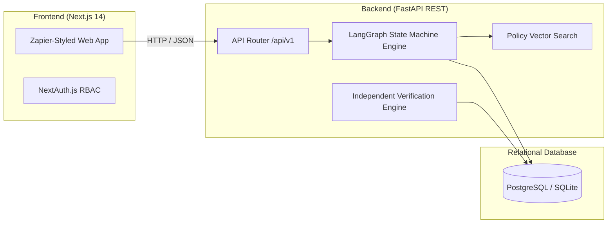

# ResolveOS 🛡️
> **Autonomous Enterprise Customer Resolution Platform**

[](https://fastapi.tiangolo.com/)
[](https://nextjs.org/)
[](https://langchain-ai.github.io/langgraph/)
[](https://www.sqlalchemy.org/)
[](LICENSE)

* **Repository**: [https://github.com/PurvaBhadange/ResolveOS-2](https://github.com/PurvaBhadange/ResolveOS-2)
* **Local Web App**: [http://localhost:3001](http://localhost:3001)
* **Backend API Docs**: [http://127.0.0.1:8001/docs](http://127.0.0.1:8001/docs)

---

## 📄 Table of Contents
1. [Header](#1-header)
2. [Overview](#2-overview)
3. [Problem](#3-problem)
4. [Solution](#4-solution)
5. [Core Workflow](#5-core-workflow)
6. [Key Features](#6-key-features)
7. [System Architecture](#7-system-architecture)
8. [Agent Architecture](#8-agent-architecture)
9. [Resolution Example](#9-resolution-example)
10. [Policy RAG](#10-policy-rag)
11. [Enterprise Systems](#11-enterprise-systems)
12. [Human-in-the-Loop](#12-human-in-the-loop)
13. [Verification & Replanning](#13-verification--replanning)
14. [Frontend](#14-frontend)
15. [Technology Stack](#15-technology-stack)
16. [Database](#16-database)
17. [Project Structure](#17-project-structure)
18. [Getting Started](#18-getting-started)
19. [API Reference](#19-api-reference)
20. [Testing](#20-testing)
21. [Security](#21-security)
22. [Deployment](#22-deployment)
23. [Documentation](#23-documentation)
24. [Future Improvements](#24-future-improvements)
25. [License](#25-license)

---

## 1. Header

* **ResolveOS**: Autonomous Enterprise Customer Resolution Engine
* **Tagline**: Bridge conversational AI with transactional enterprise execution, policy governance, and post-action verification.
* **Technology Badges**: Next.js 14, FastAPI, LangGraph, SQLAlchemy 2.0, Pydantic v2, NextAuth.js.
* **Links**:
  * GitHub Repository: [https://github.com/PurvaBhadange/ResolveOS-2](https://github.com/PurvaBhadange/ResolveOS-2)
  * Live Web App: [http://localhost:3001](http://localhost:3001)
  * Interactive API Docs: [http://127.0.0.1:8001/docs](http://127.0.0.1:8001/docs)

---

## 2. Overview

**ResolveOS** is an autonomous, safe, and verifiable customer-resolution platform designed to resolve complex e-commerce issues—returns, physical replacements, cancellations, and damaged item claims—end-to-end.

Unlike traditional conversational chatbots that only emit text responses, ResolveOS connects directly with enterprise inventory, payment processors, and order management databases. It evaluates versioned policy rules, executes state-changing database transactions using idempotency keys, independently verifies database state changes post-action, and dynamically adapts its strategy when real-world constraints (such as warehouse stockouts) are encountered.

---

## 3. Problem

Traditional customer support architectures suffer from severe structural limitations:
1. **Conversational Chatbot Impotence**: Standard LLM bots generate polite text explanations but cannot execute transactional database updates or process real refunds.
2. **High Operational Costs**: Support teams are overwhelmed by repetitive claims (damaged items, returns, cancellations), leading to slow resolution times and high labor overhead.
3. **Rigid Rule Engines**: Hardcoded automation rules fail gracefully when real-world conditions change (e.g., trying to issue a replacement when the item is out of stock across all distribution centers).
4. **Lack of Post-Action Verification**: Traditional automated workflows assume API calls succeed without verifying that relational database records (`refunds`, `payments`, `inventory`) were updated correctly.

---

## 4. Solution

ResolveOS delivers a complete, agentic resolution engine that bridges AI reasoning with enterprise transactional systems:
* **7-Node LangGraph State Machine**: Orchestrates intent understanding, evidence retrieval, policy evaluation, action execution, and independent verification.
* **Deterministic Policy & Financial Guards**: Enforces strict return windows (e.g., 15 days for electronics) and auto-approval limits ($200.00).
* **Human-in-the-Loop Operations Console**: Routes high-risk or high-value claims ($200+) to a dedicated human approval queue.
* **Autonomous Replanning**: Automatically adapts physical replacement requests to full refunds when inventory stockouts occur.
* **Independent DB Verification**: Re-queries relational database tables post-execution to verify state changes before closing cases.

---

## 5. Core Workflow

ResolveOS follows a strict 7-node state machine workflow:


`UNDERSTAND` $\rightarrow$ `EVIDENCE` $\rightarrow$ `DECIDE` $\rightarrow$ `GUARD / APPROVAL` $\rightarrow$ `ACT` $\rightarrow$ `VERIFY` $\rightarrow$ `ADAPT` $\rightarrow$ `RESOLVE / ESCALATE`

---

## 6. Key Features

* 🎯 **Agentic Resolution**: Multi-step reasoning and execution using LangGraph state graphs.
* 🏬 **Enterprise System Integration**: Full CRUD integration across Order Management, Warehouse Inventory, Shipping Carriers, and Payment Gateways.
* 📜 **Policy-Aware Decisions**: Semantic vector search against active, versioned policy documents (`v1.0`, `v2.0`).
* ⚖️ **Human Approval Gate**: Governance mechanism requiring human authorization for high-risk transactions exceeding $200.00.
* ⚡ **State-Changing Actions**: Transactional execution of refunds, replacements, and order cancellations with unique idempotency keys.
* 🔍 **Independent Verification**: Re-queries database state post-execution to confirm record creation before resolving cases.
* 🔄 **Autonomous Replanning**: Dynamically adjusts resolution strategies when constraints (like inventory stockouts) are detected.
* 🚨 **Safe Escalation**: Automatically escalates expired policy claims or invalid requests to Tier 2 support agents.
* 📜 **Comprehensive Audit Trail**: Records structured JSON payloads for every node transition in a persistent database event stream.

---

## 7. System Architecture



---

## 8. Agent Architecture

* **LangGraph Engine**: Explicit state graph written in Python (`backend/app/agent/graph.py`).
* **LLM & Rule Engine**: Powered by Google Gemini API with deterministic fallback rule heuristics for reliable execution.
* **Agent State Schema**:
  ```python
  class AgentState(TypedDict):
      case_id: int
      customer_id: int
      order_id: Optional[int]
      user_intent: str
      policy_chunks: List[str]
      order_data: Optional[Dict]
      inventory_data: Optional[Dict]
      candidate_plans: List[Dict]
      selected_plan: Optional[Dict]
      approval_required: bool
      approval_id: Optional[int]
      action_results: List[Dict]
      verified: bool
      adapted: bool
      final_status: str
  ```
* **Tools**:
  * `get_order_details`: Retrieves order items, prices, and delivery dates.
  * `check_inventory`: Queries stock levels across all distribution centers (`WH-EAST`, `WH-WEST`, `WH-CENTRAL`).
  * `search_policy_chunks`: Vector search over active policy rules.
  * `execute_refund`: Issues refund transactions with idempotency keys.
  * `execute_replacement`: Reserves inventory and creates replacement orders.
* **Resolution Guard**: Validates financial caps ($200.00) and delivery return windows (15 days for electronics).
* **Approval Gate**: Intercepts high-value claims and creates a pending approval record.
* **Verification Node**: Queries database tables (`refunds`, `payments`, `inventory`) post-execution.
* **Replanning Node**: Re-evaluates decision candidates when primary execution encounters a constraint.

---

## 9. Resolution Example

### Scenario 1: Stockout Adaptation (`ORD-2026-8801`)
1. **Customer Request**: Customer submits claim for damaged AuraSound Headphones ($199.99) requesting a physical replacement.
2. **Evidence Retrieval**: Agent fetches order `ORD-2026-8801` (delivered 2 days ago) and retrieves Active Return Policy `v2.0` (15-day window).
3. **Initial Decision**: Agent selects primary plan: *Execute Physical Item Replacement*.
4. **Constraint Detection**: Agent queries warehouse inventory for `SKU-HD-BLK`. Stock across `WH-EAST`, `WH-WEST`, and `WH-CENTRAL` shows **0 available**.
5. **Replanning**: Agent triggers **Stockout Adaptation Loop** $\rightarrow$ adapts strategy to *Issue Full Refund ($199.99)*.
6. **Action Execution**: Agent issues refund transaction `REF-8801` with idempotency key `IDEM-REF-8801`.
7. **Verification**: Verification engine re-queries `refunds` database table $\rightarrow$ confirms record created.
8. **Final Outcome**: Case status set to `RESOLVED` with adapted refund outcome.

---

## 10. Policy RAG

* **Policy Documents**: Structured Markdown policy documents stored in the database (`POL-RETURN`, `POL-CANCEL`).
* **Versioning**: Supports multiple version records (`v1.0` 30-day window vs `v2.0` 15-day active window).
* **Vector Search**: Semantic similarity search over policy chunks to pull exact policy clauses during reasoning.
* **Policy Grounding**: Every agent decision references the exact policy version and chunk index applied.

---

## 11. Enterprise Systems

ResolveOS simulates complete enterprise e-commerce entities:
* **Customers**: Profile, loyalty tier (Gold, VIP, Standard), address, return rates.
* **Orders**: Line items, status (`PROCESSING`, `SHIPPED`, `DELIVERED`, `CANCELLED`), delivery timestamps.
* **Inventory**: Stock distribution by SKU across multiple regional warehouses (`total_stock`, `reserved_stock`, `available_stock`).
* **Shipments**: Tracking numbers, carriers (FedEx, UPS), delivery confirmations.
* **Payments**: Transaction IDs, payment methods (Credit Card, PayPal, Amex).
* **Refunds**: Transaction logs, amounts, refund status (`COMPLETED`).
* **Replacements**: Replacement order tracking and warehouse allocation.
* **Cancellations**: Pre-shipment cancellation logs.

---

## 12. Human-in-the-Loop

* **Financial Guard Threshold**: Any resolution exceeding **$200.00** automatically triggers the Human Approval Gate.
* **Approval Queue**: Case status transitions to `awaiting_approval` and appears in the Operations Dashboard.
* **Judge Role**: Staff members logged in as `Operations Lead` or `Admin Supervisor` can review the claim, policy evidence, and agent reasoning.
* **One-Click Execution**: Clicking **Approve & Execute** triggers immediate agent execution and database state verification.

---

## 13. Verification & Replanning

* **Independent Post-Action Verification**: The `VerificationService` runs direct SQL queries against the database post-execution to verify:
  1. Refund transaction record exists in `refunds` table with matching amount.
  2. Order status updated in `orders` table.
  3. Inventory stock levels updated in `inventory` table.
* **Failure Recovery / Replanning**: If an action fails or inventory is 0, the state machine routes execution back to the `DECIDE` node to select the next best candidate plan rather than failing silently.

---

## 14. Frontend

Built with **Next.js 14 App Router** and styled with the **Zapier Design System** (warm cream canvas `#fffefb`, deep coffee ink `#201515`, saturated orange `#ff4f00` CTAs, 12px rounded cards):

* **Help Center**: Hero banner with 1-click test scenario presets and issue submission form.
* **Customer Account & Orders**: Purchase history, tracking statuses, and issue reporting.
* **Support Case Tracker**: Case list sidebar and interactive resolution event stream.
* **Operations Dashboard**: Real-time system metrics, pending approval queue, escalation queue, inventory constraint monitor, and active policy version inspector.
* **Agent Trace Inspector**: Visual 7-step LangGraph pipeline graph and raw JSON payload viewer.
* **Sign-In Modal**: Quick staff role authentication (`Customer`, `Operations Lead`, `Support Agent`, `Admin Supervisor`) and Google OAuth.

---

## 15. Technology Stack

* **Frontend**: Next.js 14 (App Router), TypeScript, Tailwind CSS, Lucide Icons, NextAuth.js (Auth.js v4).
* **Backend**: FastAPI (Python 3.11+), SQLAlchemy 2.0 (Async ORM), Pydantic v2, Uvicorn.
* **AI & Agent Engine**: LangGraph State Graphs, Google Gemini API, RAG Policy Vector Search.
* **Database**: SQLite (Local Development) / PostgreSQL (Neon Serverless Production).
* **Testing & Integrity**: Pytest, Alembic Migrations, Database Integrity Audit CLI.

---

## 16. Database

### Entity Overview (25+ Tables)
* `users` (Staff RBAC)
* `customers`, `customer_profiles`, `customer_addresses`
* `products`, `product_variants`, `warehouses`, `inventory`
* `orders`, `order_items`, `shipments`, `payments`
* `returns`, `refunds`, `replacement_requests`
* `support_cases`, `case_events`, `resolution_actions`, `approval_requests`, `escalations`
* `policies`, `policy_versions`, `policy_chunks`

---

## 17. Project Structure

```text
ResolveOS-2/
├── backend/
│   ├── app/
│   │   ├── agent/          # LangGraph state machine, nodes, and graph workflow
│   │   ├── api/v1/         # FastAPI REST routers (cases, orders, inventory, approvals)
│   │   ├── core/           # Database session, config, and settings
│   │   ├── models/         # SQLAlchemy 2.0 domain entity models
│   │   ├── schemas/        # Pydantic v2 request/response schemas
│   │   ├── scripts/        # Database integrity check CLI script
│   │   ├── seed/           # Data generator for synthetic seed dataset
│   │   └── services/       # Business logic (Action, Verification, Policy RAG)
│   ├── tests/              # Pytest unit & integration test suite
│   ├── Dockerfile          # Production Docker container configuration
│   ├── Procfile            # Render web service deployment process
│   ├── render.yaml         # Render Infrastructure-as-Code Blueprint
│   └── requirements.txt    # Python dependencies
├── docs/                   # System, API, Agent, Database, and Security documentation
└── frontend/
    ├── app/                # Next.js App Router pages & NextAuth route handler
    ├── components/         # Zapier-styled UI components
    ├── lib/                # API client with URL normalization & NextAuth options
    ├── vercel.json         # Vercel deployment configuration
    └── package.json        # Node.js dependencies
```

---

## 18. Getting Started

### Prerequisites
* **Python**: 3.10 or higher
* **Node.js**: 18.0 or higher
* **npm**: 9.0 or higher

### Step 1: Clone Repository
```bash
git clone https://github.com/PurvaBhadange/ResolveOS-2.git
cd ResolveOS-2
```

### Step 2: Backend Setup
```bash
cd backend

# Create virtual environment
python -m venv .venv
source .venv/bin/activate  # On Windows: .venv\Scripts\activate

# Install Python dependencies
pip install -r requirements.txt

# Run Database Seed Script
python app/seed/seed_data.py

# Start FastAPI Backend Server
uvicorn app.main:app --host 127.0.0.1 --port 8001 --reload
```
* Backend API: `http://127.0.0.1:8001`
* Interactive API Documentation: `http://127.0.0.1:8001/docs`

### Step 3: Frontend Setup
```bash
cd frontend

# Install Node dependencies
npm install

# Start Next.js Development Server
npm run dev
```
* Frontend Web App: `http://localhost:3001`

---

## 19. API Reference

### Customer & Order APIs
* `GET /api/v1/customers`: List all customers.
* `GET /api/v1/orders/customer/{customer_id}`: Fetch customer purchase history.
* `GET /api/v1/orders/number/{order_number}`: Fetch order details by order number.

### Inventory & Policy APIs
* `GET /api/v1/inventory/variant/{variant_id}`: Query stock levels across distribution centers.
* `GET /api/v1/policies/active/{code}`: Fetch active policy document (`POL-RETURN`).
* `GET /api/v1/policies/search?query=...`: Perform vector search over policy chunks.

### Resolution & Approval APIs
* `POST /api/v1/cases`: Submit a new customer support resolution request.
* `POST /api/v1/cases/{case_id}/run`: Trigger LangGraph agent execution for a case.
* `GET /api/v1/approvals?status_filter=pending`: Fetch pending human approval queue.
* `POST /api/v1/approvals/{approval_id}/decision`: Submit human approval/rejection decision.

---

## 20. Testing

### Run Pytest Suite
```bash
cd backend
python -m pytest -v
```
*Tests verify agent adaptation, return window guards, financial approval thresholds, and idempotency key uniqueness.*

### Run Database Integrity Audit
```bash
cd backend
python app/scripts/check_integrity.py
```
*Audits foreign key constraints, entity counts, stock level math, and post-action DB verification.*

---

## 21. Security

* **Authentication**: NextAuth.js credentials provider for quick role testing & Google OAuth integration.
* **Role-Based Access Control (RBAC)**: Restricts Operations Dashboard and Agent Trace Graph to staff roles (`operations`, `admin`, `support_agent`).
* **Secret Management**: Environment variables configured via `.env` files (excluded from Git).
* **LLM Guardrails**: Strict Pydantic schema validation over LLM outputs to prevent arbitrary actions.
* **Audit Logging**: Every state machine transition and DB action is logged with timestamps and execution metadata.

---

## 22. Deployment

* **Backend API (Render)**: Configured for Render Web Services using Docker (`backend/Dockerfile`) or `render.yaml`.
* **Frontend App (Vercel)**: Configured for Vercel deployment with root directory set to `frontend`.
* **Environment Variables**:
  * Frontend: `NEXT_PUBLIC_API_URL`, `NEXTAUTH_URL`, `NEXTAUTH_SECRET`.
  * Backend: `ENVIRONMENT`, `PROJECT_NAME`, `CORS_ORIGINS`.

---

## 23. Documentation

Detailed system documentation is available in the `docs/` directory:
* [Architecture Documentation](docs/ARCHITECTURE.md)
* [Agent State Machine Specification](docs/AGENT_SPEC.md)
* [API Endpoint Reference](docs/API_REFERENCE.md)
* [Database Schema Reference](docs/DATABASE.md)
* [Security & Compliance Guide](docs/SECURITY.md)

---

## 24. Future Improvements

* 📦 **Multi-Warehouse Automated Inventory Replenishment**: Trigger purchase orders to suppliers when warehouse stock reaches 0.
* 🔔 **Real-Time WebSockets Integration**: Push live node execution steps to the frontend without polling.
* 🌐 **Multi-Language Support**: Support multilingual customer claim parsing.

---

## 25. License

This project is licensed under the **MIT License** - see the [LICENSE](LICENSE) file for details.
